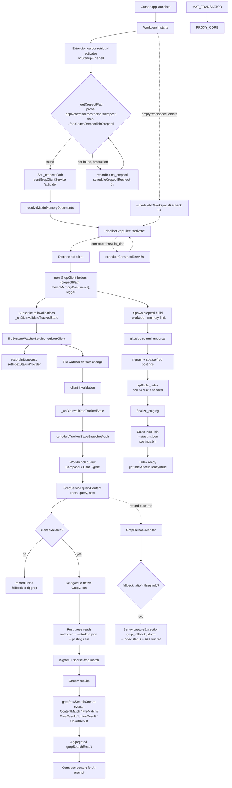
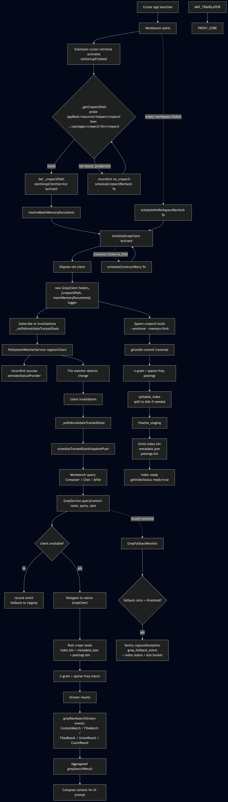

# Cursor Local Indexing — Reverse Engineering Notes

Investigated from a real installation of Cursor (Cursor.app v3.14.7, build `d5c0e77a0214208f36b56d42e8e787de88d02ea4`) on macOS arm64. All findings come from static analysis of the shipped bundle (binary `strings`, JS bundle inspection) and the extension manifest. No code was executed against a live repo.

---

## 1. What `crepectl` is

`crepectl` is the CLI frontend of Cursor's in-house Rust crate **`crepe`** (Code Repository Embedding/Processing Engine). It is **not** a public tool — the binary is shipped inside the app and only ever launched by the `cursor-retrieval` extension.

| Attribute | Value |
|---|---|
| Binary | `/Applications/Cursor.app/Contents/Resources/app/resources/helpers/crepectl` |
| Format | Mach‑O 64‑bit arm64, statically linked |
| Source layout (recovered from symbols & panic strings) | `crates/crepe/src/bin/crepectl.rs` (entry), `index_builder.rs`, `serialization.rs`, `filter.rs`, `freq.rs`, `spillable_index.rs`, `disk_index.rs`, `ngrams.rs`, `git/mod.rs` |
| Git access | `gix` / `gitoxide` (no shelling out to `git`) |
| Subcommands (recovered) | `build` — flags: `--worktree <path>`, `--memory-limit <MB>` |
| Output files | `index.bin`, `metadata.json`, `postings.bin` (plus `.staging` while building) |
| Default memory cap | 25 % of total RAM (clamped to a minimum; very low values emit a warning) |
| Self-description in `--help` | *"Crepe index management tool … Build a fresh index from a git commit"* |

`crepe` indexes **git commit content**, not a generic workspace file scan. It walks `commit_metadata`, `commit_graph`, and object DB via `gitoxide`, then computes n‑gram postings with sparse frequency counters. The `spillable_index` module flushes partial state to disk under memory pressure (`crepe-spill-key` files) before `finalize_staging` produces the binary + JSON manifest.

---

## 2. Who drives `crepectl` inside Cursor

Only **one** in-process component talks to it: the `cursor-retrieval` extension. Three bundles link against its compiled JS:

- `extensions/cursor-retrieval/dist/main.js` — the extension itself (~2.4 MB, bundles `@anysphere/file-service/file_service.darwin-universal.node`)
- `out/vs/workbench/workbench.desktop.main.js` — main workbench process
- `out/vs/workbench/workbench.glass.main.js` — glass process
- `out/vs/code/electron-utility/alwaysLocalSingleton/alwaysLocalSingletonMain.js` — utility process

### Extension manifest (key fields)

```json
{
  "name": "cursor-retrieval",
  "description": "Handles indexing and retrieval for Cursor",
  "publisher": "anysphere",
  "activationEvents": ["onStartupFinished"],
  "main": "./dist/main.js",
  "contributes": {
    "commands": [
      { "command": "cursor.grepClient.debug",            "title": "Debug Grep Client",            "when": "isDevelopment" },
      { "command": "cursor.codebaseTelemetry.triggerSnapshot", "title": "Trigger Codebase Snapshot", "when": "isDevelopment" }
    ]
  },
  "configuration": {
    "cursor-retrieval.canAttemptGithubLogin": { "type": "boolean", "default": true }
  }
}
```

The extension also registers two filename-based language IDs:

- `.cursorignore`
- `.cursorindexingignore`

These are the user-facing knobs that exclude paths from indexing.

The native bridge is the **`GrepClient`** class exported from `@anysphere/file-service/file_service.darwin-universal.node`. The TS surface that wraps it is named `GrepClient` in the bundled extension code, and is constructed as:

```ts
new GrepClient(
  workspaceFolders,                 // [{ path: string }]
  { crepectlPath, maxInMemoryDocuments },   // options
  { info, error, trace }            // logger adapter → piped to output channel / tracing
);
```

---

## 3. Lifecycle: from app launch to a queryable index

### 3.1 Boot

1. Workbench activates `cursor-retrieval` on `onStartupFinished`.
2. The extension constructor runs `_getCrepectlPath()`, which probes two locations in order:
   - `<appRoot>/resources/helpers/crepectl[.exe]`
   - `<appRoot>/../packages/crepectl/bin/crepectl[.exe]`
   It returns `{ path, prodPath, existsThrew }`.
3. If the binary is **not** found in production, it records `recordInit("no_crepectl", …, { reason: "activate", checkedPath, appRoot, platform, arch, existsThrew })` and schedules `scheduleCrepectlRecheck()` for 5 s later. This is the **post-update recovery path**: Cursor's updater drops a fresh copy of the binary in after activation, and the timer catches it.
4. If found, it sets `_crepectlPath` and calls `startGrepClientService("activate")` (guarded by `_grepClientServiceStarted`).
5. `startGrepClientService` → `initializeGrepClient("activate")`, which:
   - Resolves `maxInMemoryDocuments` (sized for the Rust spill budget).
   - Disposes any prior client, then `new GrepClient(folders, { crepectlPath, maxInMemoryDocuments }, logger)`.
   - Subscribes `_grepClient` invalidations to `_onDidInvalidateTrackedState`.
   - Registers itself with `FileSystemWatcherService.registerClient(this)`.
   - On success: `recordInit("success")` + `setIndexStatusProvider(async () => GrepClient.getIndexStatus?.())`.
6. Internally the Rust `crepe build` runs `gitoxide` commit traversal → n‑gram + sparse‑freq → `spillable_index` → finalize → emits `index.bin` / `metadata.json` / `postings.bin`. The TS side reads back `getIndexStatus()` fields: `ready / none / pendingMax / noneReason / noSnapshotReason / noneSizeMax`.

### 3.2 Steady-state

- **Filesystem changes** → `FileSystemWatcherService` → client emits invalidation → `_onDidInvalidateTrackedState` → `scheduleTrackedStateSnapshotPush` notifies downstream consumers (Composer / chat retrieval) that prior context is stale.
- **Workspace folder changes** (`onDidChangeWorkspaceFolders`) trigger a re-init.
- **External git repos** (repos on disk outside the opened workspace) are picked up lazily via `tryExternalGitIndexQuery(roots, query, opts)`. For each non-covered path it climbs to the enclosing git root, decides whether to build via `shouldBuildExternalGitIndex`, and constructs a per-repo `GrepClient`. Results live in an LRU Map (`_externalGitIndexes`) with `evictExternalGitIndexesToCapacity()`.

### 3.3 Failure / retry — three independent recovery timers

| Timer | When it fires | What it does |
|---|---|---|
| `scheduleNoWorkspaceRecheck` | Workspace folder list was empty at activation | After 5 s, recheck; if folders exist now, call `initializeGrepClient("noWorkspaceRecheck")` and record `noWorkspaceRecovered`. |
| `scheduleCrepectlRecheck` | Binary missing at activation (post-update race) | After 5 s, re-probe; if found, record `crepectlRecovered` and start the service. |
| `scheduleConstructRetry` / `retryConstruct` | Rust side surfaced a transient `.git/index` IO error (regex `/io_kind=Some\(/`) | After 5 s, retry construct. On recovery, records `constructRecovered`. |

### 3.4 Fallback monitor (telemetry / Sentry)

`GrepFallbackMonitor` (gated by feature flag `grep_fallback_monitor`) tallies outcomes (`success / uninit / threw / unsupported / no_workspace / no_crepectl / construct_threw`) over a sliding window. When the ratio of non-`served` samples exceeds `fallbackRatioThreshold`, it raises a `captureException` tagged `grep_fallback_storm` carrying:

- Top fallback reason: `unsupported_shape / index_unavailable / exec_failure / timeout / no_overlap / unknown`
- Init error verbatim (may include the `crepectl` install path — internal-gated only)
- Index status snapshot: `ready / none / pendingMax / noneReason / noSnapshotReason / noneSizeMax`
- Bucketed index size: `lt_10k / 10k_50k / 50k_250k / 250k_plus`
- Per‑failure disambiguators:
  - **no_workspace** → `initHasWorkspaceFile / initRemoteName / initReason / initNoWorkspaceRecovered`
  - **no_crepectl** → `initCheckedPath / initAppRoot / initPlatform / initArch / initExistsThrew / initCrepectlRecovered`
  - **construct_threw** → `initErrorKind` (the `std::io::ErrorKind` from Rust) + `initConstructRecovered`

The reported‑side comment in the bundle is explicit that `initCheckedPath` *"may include an install path and is internal-gated only."*

---

## 4. Retrieval path (how a query becomes a result)

1. A retrieval request arrives in the extension as `(roots: string[], query: string, opts: GrepSearchParams)`.
2. `GrepService.queryContent(roots, query, opts)`:
   - If no client: `_fallbackMonitor.record("uninit")` → return `null` (caller falls back to the VS Code `textSearchProvider2` / ripgrep path).
   - Else: `trace`-log query/roots/opts, delegate to the native `GrepClient`.
3. The Rust `crepe` side reads `index.bin` / `metadata.json` / `postings.bin`, runs n‑gram + sparse‑freq matching, streams results back.
4. Results come through the TS surface as:
   - Stream events: `grepRawSearchStream`
   - Per-result types: `grepRawSearchContentMatch`, `grepRawSearchFileMatch`, `grepRawSearchFilesResult`, `grepRawSearchUnionResult`, `grepRawSearchCountResult`
   - Errors: `grepRawSearchError` with structured reasons (`unsupported_shape / index_unavailable / exec_failure / timeout / no_overlap / unknown`)
5. Aggregation exposes `grepSearchResult` / `grepSearchResultInternal` to the workbench.
6. Downstream consumers — Composer, Chat, `@`-file references — subscribe to the tracked-state snapshot stream and re-query when an invalidation fires (step 3.2).

---

## 5. End-to-end flow diagram



---

## 6. Concrete files & strings I verified

| Path | What it tells us |
|---|---|
| `/Applications/Cursor.app/Contents/Resources/app/resources/helpers/crepectl` | The Rust binary itself |
| `…/extensions/cursor-retrieval/package.json` | Extension manifest, activation, contributed commands, `.cursorignore` / `.cursorindexingignore` |
| `…/extensions/cursor-retrieval/dist/main.js` | Lifecycle: `_getCrepectlPath`, `GrepFallbackMonitor`, `_externalGitIndexes` LRU, three recovery timers |
| `…/extensions/cursor-retrieval/node_modules/@anysphere/file-service/file_service.darwin-universal.node` | Native `GrepClient` binding |
| `out/vs/workbench/workbench.desktop.main.js` | Main workbench — references `crepe` (loads the retrieval extension) |
| `out/vs/workbench/workbench.glass.main.js` | Glass process — same |
| `out/vs/code/electron-utility/alwaysLocalSingleton/alwaysLocalSingletonMain.js` | Utility process — same |

Binary string samples that confirm the architecture:

- `Crepe index management tool`, `Build a fresh index from a git commit`
- `crates/crepe/src/bin/crepectl.rs`, `index_builder.rs`, `serialization.rs`, `filter.rs`, `freq.rs`, `spillable_index.rs`, `disk_index.rs`, `ngrams.rs`, `git/mod.rs`
- `Memory limit in megabytes for building the index. Uses disk spilling for memory-bounded indexing. … Defaults to 25% of total system RAM.`
- `finalize_staging called without staging directory`, `failed to finalize index`, `failed to serialize index`
- `index.bin`, `metadata.json`, `postings.bin`
- `WORKTREE` (the required positional arg), `COMMIT`, `Git commit SHA to index (defaults to HEAD)`
- `gitoxide` (used for git access instead of shelling out)
- Path resolution at runtime: `Ra.join(e, "resources", "helpers", "crepectl" + ".exe" on win32)` then `Ra.join(e, "..", "packages", "crepectl", "bin", …)`
- Native add-on loader: `new a.GrepClient(t, { crepectlPath: this._crepectlPath, … }, loggerAdapter)`

---

## 7. TL;DR

- `crepectl` is a private Rust CLI (binary inside the app) that implements Cursor's **local code indexing engine** (`crepe` crate).
- The `cursor-retrieval` extension is the only driver. It locates the binary, wraps it in a native `GrepClient`, wires in a filesystem watcher for invalidations, and exposes the index for Composer / Chat / `@`-file retrieval.
- The system is built to be resilient across three races — empty workspace at activation, missing binary after auto-update, transient `.git/index` IO — via 5‑second recovery timers and a Sentry-backed fallback monitor.
- `crepe` indexes **git commits** (via `gitoxide`), not arbitrary files. Excludes are driven by `.cursorignore` and `.cursorindexingignore`.
- All retrieval goes through the same `GrepClient` instance; on failure the caller falls back to VS Code's `textSearchProvider2` (ripgrep).
